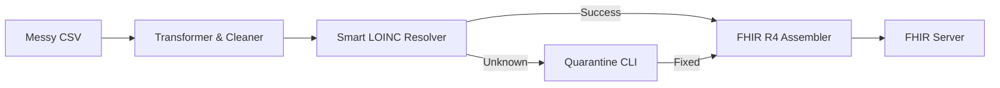

# Struct2FHIR 🏥

**Struct2FHIR** is a fast, configurable gateway that seamlessly converts raw, messy laboratory CSV data into standardized **FHIR R4 Observation** resources. 

Instead of writing custom parsing code for every new lab or hospital system you integrate with, Struct2FHIR uses a **fixed core engine with swappable YAML configuration files**. You define the column mappings once, and the engine handles the rest!

## 🌟 Key Features

* **Zero-Code Integration**: Support a completely new CSV format just by writing a 20-line YAML file.
* **Smart LOINC Resolution**: Automatically determines the correct LOINC codes for lab tests using a 3-tier engine:
  1. Sub-millisecond Local Cache
  2. Offline Fuzzy Matching (RapidFuzz)
  3. Online Fallback to the NLM Clinical Tables API
* **Human-in-the-Loop Quarantine**: Unrecognized lab names are gracefully caught and sent to "Quarantine" where a user can resolve them via an interactive CLI tool.
* **High Performance**: Use `main_async.py` to concurrently process massive hospital datasets.

---

## 🛠️ How It Works



---

## 🚀 Quick Start Guide

### 1. Installation 
Clone the repository and install the dependencies:
```bash
git clone https://github.com/OoONANCY/Struct2FHIR.git
cd Struct2FHIR
pip install -r requirements.txt
```

### 2. Download the LOINC Data (One-Time Setup)
Due to licensing, we cannot distribute the raw LOINC database. You must download it yourself:
1. Register for a free account at [loinc.org](https://loinc.org).
2. Download the latest **LOINC Table Core** (`Loinc.csv`).
3. Run our built-in tool to extract just the lab terms we need into a tiny, fast 5MB JSON file:
```bash
python tools/build_corpus.py --input ~/Downloads/Loinc.csv
```
*(Once this completes, you can delete the massive 900MB raw LOINC folder!)*

### 3. Configure Your Data Source
Create a simple YAML file telling Struct2FHIR what the columns in your incoming CSV correspond to. 

Create `config/sources/my_lab.yaml`:
```yaml
source_name: "my_lab_system"
fhir_server_url: "https://your-fhir-server.com/fhir"
# fhir_auth_token: "YOUR_TOKEN" (Or just export FHIR_AUTH_TOKEN in your terminal)
patient_id_system: "urn:oid:2.16.840.1.113883.3.example"

# Map exactly what the headers are in your CSV file
column_map:
  patient_id:      "Patient_ID"         
  lab_name:        "Test_Name"          
  value:           "Result_Value"            
  unit:            "Units"             
  collected_at:    "Draw_Date"     
  reference_range: "Ref_Range"          
```
*(Check out `config/sources/example_lab.yaml` or `eicu_lab.yaml` for advanced use cases like date-parsing rules or find-and-replace transformations).*

### 4. Validate and Run!
First, make sure your config perfectly matches your CSV file:
```bash
python tools/validate_config.py --config config/sources/my_lab.yaml --csv my_data.csv
```

Do a **Dry Run** to see exactly what the generated FHIR JSON will look like before actually sending it to your server:
```bash
python main.py --config config/sources/my_lab.yaml --input my_data.csv --dry-run
```

If it looks good, run it for real!
```bash
python main.py --config config/sources/my_lab.yaml --input my_data.csv
```

---

## 🏎️ Production Mode (Async Processing)
For massive datasets (e.g. 500k+ rows), use the asynchronous pipeline. It uses 20 concurrent workers (configurable) to blast the data to your FHIR server significantly faster.
```bash
python main_async.py --config config/sources/my_lab.yaml --input my_data.csv --workers 20
```

---

## 🏥 Exception Handling: The Quarantine System

If your CSV contains a lab name that Struct2FHIR cannot confidently map to a LOINC code (e.g., `"unknown string 123"`), it will **not** crash. Instead, it places that row into Quarantine.

You can periodically review quarantined items to train the system:
```bash
python -m quarantine.reviewer
```
The interactive CLI will show you the unknown test name and suggest the best fuzzy or API matches. You can accept a match, enter a LOINC code manually, or mark it as unmappable.

Once you resolve the quarantined items, send them to the server:
```bash
python -m quarantine.reprocessor --config config/sources/my_lab.yaml
```
**The Best Part:** Any choices you make in Quarantine are permanently saved to your Local Dictionary. If that weird lab name ever appears again tomorrow, it will be mapped automatically without human intervention! 

---

## 🧪 Running Tests
Want to contribute or verify the code?
```bash
pytest -v
```
