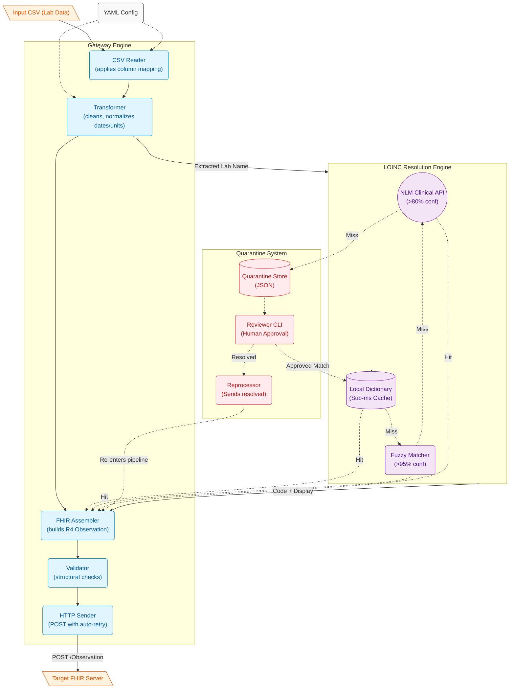

# Struct2FHIR — Architecture & User Flow

This document outlines the final architecture and the exact step-by-step flow a typical user takes when adopting and running the FHIR Gateway.

## 1. Final Architecture Diagram



---

## 2. Complete User Workflow

Below is the step-by-step lifecycle of a user adopting the tool for a new lab CSV schema.

### Phase 1: One-Time Setup

**1. Get LOINC Data**
The user registers for free at loinc.org, downloads [Loinc.csv](file:///Users/nancysmac/Coding/Struct2FHIR/Loinc_2.82/LoincTable/Loinc.csv) (~928MB), and generates the lightweight lookup corpus mapping.
```bash
python tools/build_corpus.py --input ~/Downloads/Loinc.csv
# ↳ Creates a 4.8MB loinc_corpus.json and fully deletes the rest.
```

### Phase 2: Onboarding a New CSV Source

**1. Create a Configuration**
The user creates a YAML file mapping their specific CSV columns to the standard fields.
```bash
cp config/sources/example_lab.yaml config/sources/city_hospital.yaml
# They edit city_hospital.yaml, mapping e.g., 'Test_Description' → 'lab_name'
```

**2. Validate the Setup**
The workflow verifies that the YAML syntax is valid and perfectly matches the actual headers in their data.
```bash
python tools/validate_config.py --config config/sources/city_hospital.yaml --csv data.csv
```

**3. Dry-Run Verification**
The user pushes the first 50 rows through without actually sending anything over the network, inspecting the generated FHIR JSON visually.
```bash
python main.py --config config/sources/city_hospital.yaml --input data.csv --dry-run --limit 50
```

### Phase 3: Production Processing

**1. Process the File**
For massive files, the user invokes the asynchronous pipeline, utilizing 20 concurrent workers to blitz through thousands of rows per second.
```bash
python main_async.py --config config/sources/city_hospital.yaml --input data.csv --workers 20
```

* Behind the scenes, the gateway hits the Local Dictionary instantly. If the lab test is totally new, it uses Fuzzy Matching, and if that is unsure, it queries the NLM API online.
* Successful resolutions are immediately cached back to the dictionary, making the system progressively faster every second.

### Phase 4: Exception Handling (Quarantine)

Any test names that are completely unrecognizable (e.g. `xyz123 fluid`) are silently caught and dropped into Quarantine without halting the main pipeline.

**1. Review Failures**
The user periodically pulls up the reviewer CLI.
```bash
python -m quarantine.reviewer
```
The CLI shows the obscure test name and suggests the closest fuzzy/API matches. The user types `1` to accept a match, or `m` to manually type in a LOINC code they looked up themselves.

**2. Reprocess the Fixed Data**
Once reviewed, the records are seamlessly re-injected into the FHIR pipeline and sent to the server.
```bash
python -m quarantine.reprocessor --config config/sources/city_hospital.yaml
```

**3. Future Proofing**
Because the user approved the map in Quarantine, that mapping is permanently saved to their Local Dictionary. The next time `xyz123 fluid` appears in tomorrow's CSV, it processes instantly with zero human intervention.
